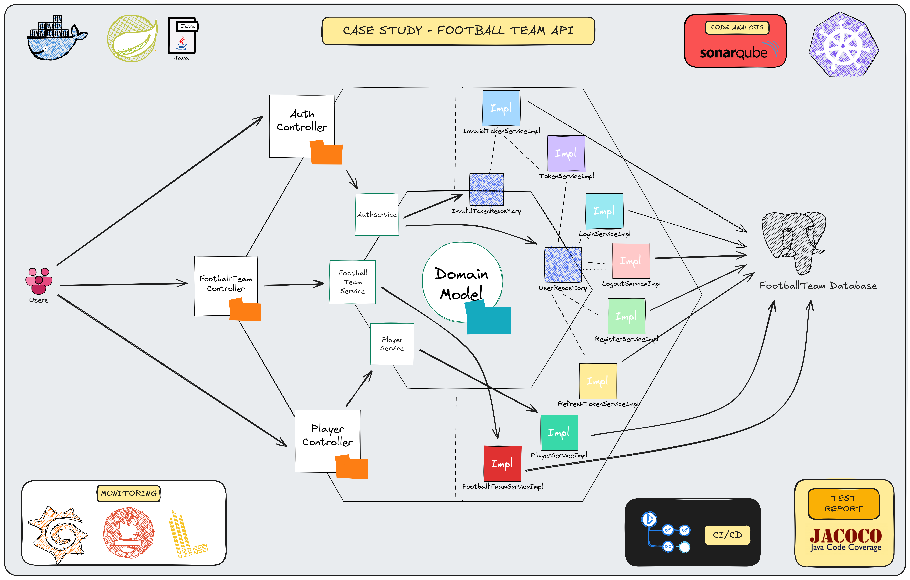

# Case Study - Football Team Api (Hexagonal Architecture)

<p align="center">
    
</p>

### 📖 Information

<ul style="list-style-type:disc">
   <li>
      <b>Soccer Team Management Service:</b>
      <ul>
         <li>
            Implement a Spring Boot-based service through hexagonal architecture for managing soccer teams and their associated players, encompassing functionalities for team listing, player retrieval by team ID, and support for team and player updates or deletions
         </li>
         <li>
            <b>Functional Features:</b>
            <ul>
               <li>List all soccer teams.</li>
               <li>List players of a selected soccer team using the team’s ID.</li>
               <li>Delete or update a soccer team using its ID.</li>
               <li>Delete players from a soccer team or add a new player to the team.</li>
            </ul>
         </li>
         <li>
            <b>Business Rules:</b>
            <ul>
               <li>A soccer team can have a maximum of 18 players.</li>
               <li>Only up to 6 players on a team can be foreigners.</li>
               <li>A maximum of 2 goalkeepers can be defined per team.</li>
            </ul>
         </li>
      </ul>
   </li>
</ul>


### Explore Rest APIs

Endpoints Summary
<table style="width:100%;">
    <tr>
        <th>Method</th>
        <th>Url</th>
        <th>Description</th>
        <th>Request Body</th>
        <th>Path Variable</th>
        <th>Response</th>
    </tr>
    <tr>
        <td>POST</td>
        <td>/api/v1/authentication/user/register</td>
        <td>Register for Admin or User</td>
        <td>RegisterRequest</td>
        <td></td>
        <td>CustomResponse&lt;Void&gt;</td>
    </tr>
    <tr>
        <td>POST</td>
        <td>/api/v1/authentication/user/login</td>
        <td>Login for Admin or User</td>
        <td>LoginRequest</td>
        <td></td>
        <td>CustomResponse&lt;TokenResponse&gt;</td>
    </tr>
    <tr>
        <td>POST</td>
        <td>/api/v1/authentication/user/refresh-token</td>
        <td>Refresh Token for Admin or User</td>
        <td>TokenRefreshRequest</td>
        <td></td>
        <td>CustomResponse&lt;TokenResponse&gt;</td>
    </tr>
    <tr>
        <td>POST</td>
        <td>/api/v1/authentication/user/logout</td>
        <td>Logout for Admin or User</td>
        <td>TokenInvalidateRequest</td>
        <td></td>
        <td>CustomResponse&lt;Void&gt;</td>
    </tr>
        <tr>
        <td>POST</td>
        <td>/api/v1/football-teams</td>
        <td>Create a new football team</td>
        <td>CreateFootballTeamRequest</td>
        <td>-</td>
        <td>CustomResponse&lt;FootballTeamResponse&gt;</td>
    </tr>
    <tr>
        <td>PUT</td>
        <td>/api/v1/football-teams/{teamId}</td>
        <td>Update an existing football team's name</td>
        <td>UpdateFootballTeamRequest</td>
        <td>teamId (UUID)</td>
        <td>CustomResponse&lt;FootballTeamResponse&gt;</td>
    </tr>
    <tr>
        <td>GET</td>
        <td>/api/v1/football-teams/{teamId}</td>
        <td>Retrieve a football team's details by ID</td>
        <td>-</td>
        <td>teamId (UUID)</td>
        <td>CustomResponse&lt;FootballTeamResponse&gt;</td>
    </tr>
    <tr>
        <td>DELETE</td>
        <td>/api/v1/football-teams/{teamId}</td>
        <td>Delete a football team by ID</td>
        <td>-</td>
        <td>teamId (UUID)</td>
        <td>CustomResponse&lt;Void&gt;</td>
    </tr>
    <tr>
        <td>POST</td>
        <td>/api/v1/football-teams/teamsList</td>
        <td>Retrieve a paginated list of football teams</td>
        <td>FootballTeamPagingRequest</td>
        <td>-</td>
        <td>CustomResponse&lt;CustomPagingResponse&lt;FootballTeamResponse&gt;&gt;</td>
    </tr>
    <tr>
        <td>POST</td>
        <td>/api/v1/football-teams/{teamId}/players</td>
        <td>Add a new player to a team</td>
        <td>AddPlayerRequest</td>
        <td>teamId (UUID)</td>
        <td>CustomResponse&lt;PlayerResponse&gt;</td>
    </tr>
    <tr>
        <td>PUT</td>
        <td>/api/v1/football-teams/{teamId}/players/{playerId}</td>
        <td>Update an existing player on a team</td>
        <td>UpdatePlayerRequest</td>
        <td>teamId (UUID), playerId (UUID)</td>
        <td>CustomResponse&lt;PlayerResponse&gt;</td>
    </tr>
    <tr>
        <td>DELETE</td>
        <td>/api/v1/football-teams/{teamId}/players/{playerId}</td>
        <td>Delete a player from a team</td>
        <td>-</td>
        <td>teamId (UUID), playerId (UUID)</td>
        <td>CustomResponse&lt;Void&gt;</td>
    </tr>
    <tr>
        <td>GET</td>
        <td>/api/v1/football-teams/{teamId}/players</td>
        <td>Retrieve a paginated list of players for a team</td>
        <td>PlayerPagingRequest</td>
        <td>teamId (UUID)</td>
        <td>CustomResponse&lt;CustomPagingResponse&lt;PlayerResponse&gt;&gt;</td>
    </tr>
</table>


### Technologies

---
- Java 21
- Spring Boot 3.0
- Restful API
- Open Api (Swagger)
- Maven
- Junit5
- Mockito
- Integration Tests
- TestContainers
- Docker
- Docker Compose
- CI/CD (Github Actions)
- Postman
- Prometheus
- Grafana
- Kubernetes
- JaCoCo (Test Report)
- Sonarqube
- Loki (Log Aggregation System)

### Postman

```
Import postman collection under postman_collection folder
```


### Prerequisites

#### Define Variable in .env file

```
FOOTBALL_TEAM_DB_IP=localhost
FOOTBALL_TEAM_DB_PORT=5432
POSTGRES_USER={POSTGRES_USER}
POSTGRES_PASSWORD={POSTGRES_PASSWORD}
```

### Open Api (Swagger)

```
http://localhost:3112/swagger-ui/index.html
```

---

### JaCoCo (Test Report)

After the command named `mvn clean install` completes, the JaCoCo report will be available at:
```
target/site/jacoco/index.html
```
Navigate to the `target/site/jacoco/` directory.

Open the `index.html` file in your browser to view the detailed coverage report.

---

### Maven, Docker and Kubernetes Running Process


### Maven Run
To build and run the application with `Maven`, please follow the directions shown below;

```sh
$ cd footballteamapi
$ mvn clean install
$ mvn spring-boot:run
```

---

### Docker Run
The application can be built and run by the `Docker` engine. The `Dockerfile` has multistage build, so you do not need to build and run separately.

Please follow directions shown below in order to build and run the application with Docker Compose file;

```sh
$ cd footballteamapi
$ docker-compose up -d
```

If you change anything in the project and run it on Docker, you can also use this command shown below

```sh
$ cd footballteamapi
$ docker-compose up --build
```

To monitor the application, you can use the following tools:

- **Prometheus**:  
  Open in your browser at [http://localhost:9090](http://localhost:9090)  
  Prometheus collects and stores application metrics.

- **Grafana**:  
  Open in your browser at [http://localhost:3000](http://localhost:3000)  
  Grafana provides a dashboard for visualizing the metrics.  
  **Default credentials**:
    - Username: `admin`
    - Password: `admin`

- Define prometheus data source url, use this link shown below

```
http://prometheus:9090
```

- Define loki data source url, use this link shown below

```
http://loki:3100
```

---

### Kubernetes Run
To build and run the application with `Maven`, please follow the directions shown below;

- Start Minikube

```sh
$ minikube start
```

- Open Minikube Dashboard

```sh
$ minikube dashboard
```

- To deploy the application on Kubernetes, apply the Kubernetes configuration file underneath k8s folder

```sh
$ kubectl apply -f k8s
```

- To open Prometheus, click tunnel url link provided by the command shown below to reach out Prometheus

```sh
minikube service prometheus-service
```

- To open Grafana, click tunnel url link provided by the command shown below to reach out Prometheus

```sh
minikube service grafana-service
```

- Define prometheus data source url, use this link shown below

```
http://prometheus-service.default.svc.cluster.local:9090
```

- Define loki data source url, use this link shown below

```
http://loki-service.default.svc.cluster.local:3100
```

---
### Docker Image Location

```
https://hub.docker.com/repository/docker/noyandocker/footballteamapi/general
```

### Define Loki through Grafana

- Define Loki Dashboard
- Define `query` after selecting data source as `Loki`
- Define `Label Filter` as `app` and its value `footballteamapi`
- Run the `query`
- Show the result in the Dashboard

### Sonarqube

- Go to `localhost:9000` for Docker and Go there through `minikube service sonarqube` for Kubernetes
- Enter username and password as `admin`
- Change password
- Click `Create Local Project`
- Choose the baseline for this code for the project as `Use the global setting`
- Click `Locally` in Analyze Method
- Define Token
- Click `Continue`
- Copy `sonar.host.url` and `sonar.token` (`sonar.login`) in the `properties` part in  `pom.xml`
- Run `mvn sonar:sonar` to show code analysis


### Screenshots

<details>
<summary>Click here to show the screenshots of project</summary>
    <p> Figure 1 </p>
    
</details>


### Contributors

- [Sercan Noyan Germiyanoğlu](https://github.com/Rapter1990)